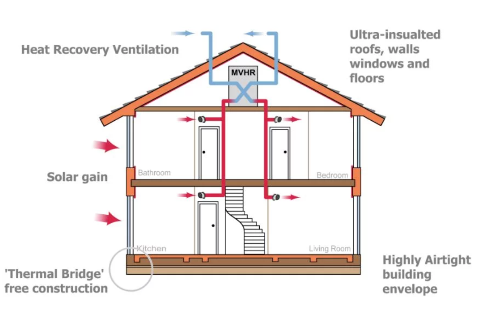

```{r setup, include=FALSE}
knitr::opts_chunk$set(echo = FALSE)
```

```{r env}
library(dplyr)
library(ggplot2)
```

The idea of a passive house started in Germany (passivhaus) and relies on a few basic elements of building design - insulation, airtightness and solar gain - to create really comfortable, low energy homes. The focus is on the building's fabric and minimising energy demand (especially through space heating) whilst providing high levels of comfort for occupants throughout the year.

Passivhaus is a standard in building design that can be applied to new builds (where it should be rapidly adopted as the default standard) and renovations of existing housing stock ("retrofit"). The 3 key elements (Fig. 1) are: 

```{r fig1, fig.cap="Principles of passivhaus design. Source: Sustainable Design Collective"}

```

1. Form (shape) and orientation (for solar gain) - Compact buildings have greater volume per surface area which means that for the same space you can reduce the available surface through which the building can shed energy. The building's orientation is considered with respect to energy that can be captured from the sun via windows ("solar gain" = free energy but also an overheating risk).
2. Insulation - insulate a lot everywhere to minimise energy loss out of your building and design insulation to be continuous to minimise thermal bridges (there will be a dedicated post on this).
3. Airtightness - every hole in a building is a pathway for energy to escape so passivhaus relies on creating extremely airtight buildings. I (think I) read that the airtightness standard that is provided for by current building regs equates to a hole in your wall that is the size of a cash machine (when you combine all the holes and gaps across the whole building), whereas the combination of the same in a passivhaus would add up to a hole the size of the bank card you put in that ATM! You might worry about air quality in a (nearly) sealed building but this is actually much improved in a passivhaus over a conventional building due to the incorporation of mechanical ventilation with heat recovery, machines which cycle air and recover the energy from outgoing air and pass it to the fresh incoming (mechanical ventilation with heat recovery, MVHR).

## Retrofit
It's probably fairly obvious that applying those 3 key design elements to an existing building can be pretty challenging. You get what you get in terms of form and orientation with an existing building but you can still try to optimise glazing for the orientation you have and there may be options to simplify the form by extending or removing a part of a building that projects from the main shape. Also, typically, thermal bridges cannot be avoided in retrofit so it's a case of minimising as best you can in order that no surfaces are cool enough to affect comfort or lead to condensation. And whilst you can take care over airtightness, MVHR duct runs for ventilation, which can easily be designed into new builds, can be really difficult to plan in a retrofit.  

Given the challenges of retrofit, the passivhaus standard for existing buildings (EnerPhit) has relaxed expectations when it comes to airtightness and heat demand but energy used for space heating will still be way down on an average comparable home (Fig. 2).  

```{r fig2, fig.cap="Passivhaus energy use versus an average home"}
data <- dplyr::tibble(
  house = c("Average existing", "Average new build", "Enerphit retrofit", "Passivhaus"),
  heat = c(145, 55, 25, 15),
  ach = c(10, 5, 1, 0.6)
)

heating <- data %>% 
  ggplot(aes(x = house, y = heat)) +
  geom_col(fill = "#ff4500") +
  scale_y_continuous(expand = expansion(mult = c(0, 0.05))) +
  theme_bw() +
  theme(axis.title = element_blank()) +
  labs(title = "Heat demand (KWh/m2/year) by house type")

at <- data %>% 
  ggplot(aes(x = house, y = ach)) +
  geom_col(fill = "#a1caf1") +
  scale_y_continuous(expand = expansion(mult = c(0, 0.05))) +
  theme_bw() +
  theme(axis.title = element_blank()) +
  labs(title = "Air changes per hour by house type")

cowplot::plot_grid(heating, at, ncol = 1)
```

## Renewables
While the focus is on building fabric it obviously makes sense to add renewables and we'll be using an air source heat pump to provide heating and hot water as well as strengthening the roof to allow solar to be added later.   

## Find out more
This has been a whistle-stop tour of the fundamentals of passivhaus. If you want to find out more, [Elrond Russell's blogs on passivhaus might be a good place to take a look](https://elrondburrell.com/blog/category/passivhaus-basics/).  
